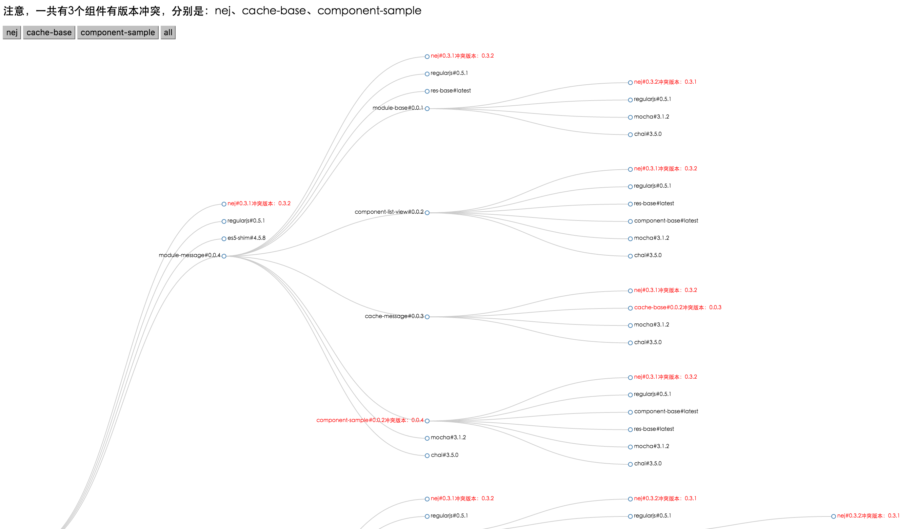
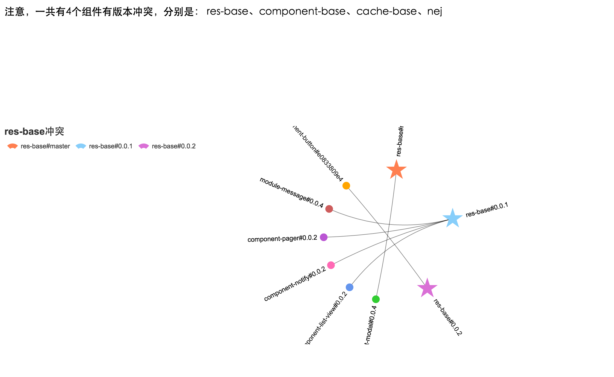

# bower-conflict
> 可视化工程中的bower依赖冲突  
> Front end visualization bower dependency and conflict

### how to use
- npm install bower-conflict -g
- cd to the your project
- run bower-conflict
- it will open browser automatically

### bower dependency tree (red color is conflict)

### bower conflict node conclusion
